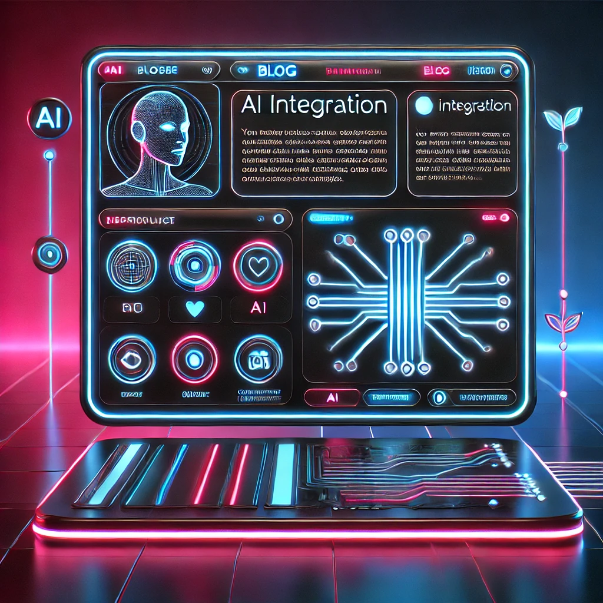
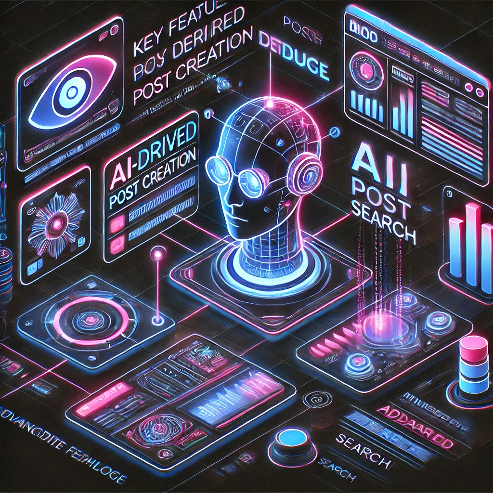
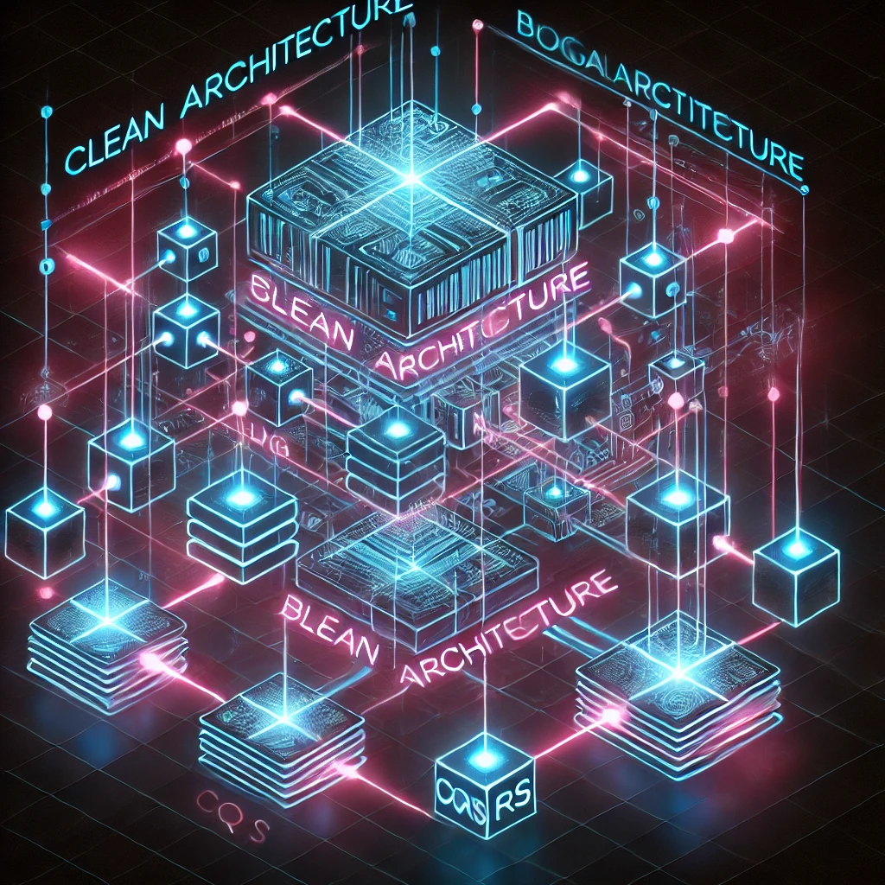

# IntelliBlog

### Status

:warning: This repo has just been made public and it's still under **heavy** development. Consider it a work in progress.

:calendar: Our target date for the first usable release is **August/September**, but don't be surprised by delays. 

## Overview
[License: MIT]

IntelliBlog (I-Blog) is a minimalist blogging system that focuses on simplicity while providing a rich set 
of features, integration with AI and an enteprise-ready architecture that is easy to use and to manage.

We think of IntelliBlog as the *most over-engineered blogging system in the world*, but the concepts and 
patterns we use in the solution are applicable to more complex domains.

> :ok_hand: **I-Blog is ultimately meant to be downloaded and used by anybody, but at the same time it is also an ever-evolving 
reference for .NET and C# developers who are looking for a real-world example of how to apply certain architectral patterns and concepts to their solutions.**

We reccomend you read the rest of the sections in this document to get a better understanding of what IntelliBlog is and the architectural goals we set for it, but when you feel ready to get IntelliBlog running on your system, you can go to the [Getting Started](#getting-started) section.

## Who is I-Blog for?

I-Blog targets two user groups:
1) Anybody who wants to run a blog on local hardware (maybe without an Internet connection) or in the cloud, but with minimum effort and neither the complexity nor the price tag of other OSS or commercial blogging systems.

> If you are not a developer interested in the architecture and patterns used in the solution, jump directly to the [Getting Started](#getting-started) section to get I-Blog running on your system.

2) .NET developers who want to see how to apply architectural patterns and concepts such as Clean Architecture, Domain Driven Design, CQRS, Event-Driven Architecture, GraphQL, etc. to a real-world product. 

> If you are here for software architecture, please continue reading.

## What ~~does~~ will it do?

I-Blog allows users to create and manage one or more online blogs that come with an integrated AI Assistant that ready to interact with the readers and is trained and grounded on your blog content.

In addition to normal Create, Read, Update and Delete (CRUD) operations on posts, sources, comments, etc., I-Blog includes a number of advanced features that make it unique.

I-Blog uses AI to:

1. Automate the creation of new posts.
    - Users can create a full post by simply pasting a URL to a web page or a YouTube video.
    - This process will be template driven and user-configurable.

2. Simplify the editing and proof-reading of posts.
    - Users can use the AI Assistant to help them spell check or correct grammar, or even rewrite parts of the post.

3. Perform Semantic Search on the entire content of the blog and its posts.
    - Users can search for posts using natural language (English) instead of keywords and limited drop down filters.
    - A search for "How do I create a blog?" would return posts with titles such as "How to create a blog", "Creating a blog in 2022", "The best way to start a blog", etc.

4. Interact with an AI Assistant and ask questions to the I-Blog itself.

### The Posts are the memory

In I-Blog, each post becomes instantly part of the memory that is available to the AI Assistant. 

After a new post is created or an existing post is updated, a background process will chunk the post and store it in a vector database which is accessible to the AI Assistant. 

## The main features

1) A minimalist interface that only does what it needs to do, and nothing more.
> At the core of I-Blog there's a simple and intuitive interface that allows users to create, edit and manage posts, sources and other entities in the system.  
> The interface is designed to be easy to use and it will be developed using Blazor and FluentUI.
> Intelligent search features based on the integration with Elasticsearch for full-text search, or with vector databases for semantic search, are included.

2) Users can create a full post by simply pasting a URL to a web page or a YouTube video.
> IntelliBlog will download the content of the page or the transcript of the video, and use generative AI to create a draft post complete of title, text, TL;DR and much more. The generated content can then be edited and shared.

3) Each post will be stored in I-Blog's vectorized memory system and will be immediately available to I-Blog's AI Assistant. The assistant can be used to search for posts, or to answer any question on the contents of the entire blog.
> The I-Blog assistant will offer chat and voice interfaces.
> The I-Blog assistant can also be used to ask for more information on a topic, find related posts, etc.

4) Each post can be linked to one or more sources.
> Sources are an essential part of the IntelliBlog system, and they can be used to initiate posts, to provide additional information, to give credit to the original authors, and to help users find more information on the topics discussed in the post.  
> Sources are a first class citizen in I-Blog.

5) A complete management console based on Microsoft Aspire
> Allows administrators to trace and manage all the activities in the system and have full control and visibility of the multi-container solution.

6) [ :warning: TBC]

## Patterns and Concepts

The IntelliBlog project is a playground for a number of architectural patterns and concepts. 

The architecture we adopted is heavily inspired by the Clean Architecture (CA) and Domain Driven Design (DDD) work of experts like [Jason Taylor](https://github.com/jasontaylordev/CleanArchitecture), [Steve "Ardalis" Smith"](https://github.com/ardalis/CleanArchitecture), [Vaughn Vernon](https://github.com/VaughnVernon/IDDD_Samples_NET) and more, but it adds a few twists of its own, such as:

1) A more straighforward way to deal with the never-ending work on the query-side of CQRS: Can we generalize how we search better?
> Frontend developers using REST interfaces are often required to ask for new endpoints, or to ask for changes in existing endpoints very time a new piece of data comes up. 
  The final endpoints often end up over-fetching or under-fetching data, and a lot of back-and-forth between frontend developers and ackend developers is required to get the data right.
  We believe **the combination of GraphQL and the Relay patterns solve this problem** and make frontend development a lot easier than without, even when comparing to using OData or similar technologies.

2) A simpler way to think of Domain and Application layers: Unite but keep divided.
> Do we really need 2 projects for the Domain and Application layers? We think not. We believe that the Domain and Application layers can be combined into a single project, and that this makes it easier to navigate the solution and to understand the relationships between the different parts of the system.

3) Cross-cutting concerns: Pipelines and Interceptors.
> In the Blogging project containing Domain and Application, we use MediatR pipelines to handle cross-cutting concerns such as validation and transaction management (i.e. Unit of Work pattern).  
> In the Infrastructure project we use Entity Framework Interceptors to dispatch domain events, raise CRUD events and handle other cross-cutting concerns such as setting properties like CreatedBy, LastModifiedOn, etc.  
> Pipelines and interceptors are a powerful way to keep the code clean and to separate concerns.

4) Self-documenting and self-descriptive code.
> We put a lot of effort in avoiding anemic domain models.  
> We believe our domain entities and aggregate roots are self-descriptive and self-documenting, and that it is easy to understand what each class does and how it relates to other classes.  

5) Aggregate Roots, relationships and bounded contexts.
> It is often hard to decide what should be an aggregate root and what should be included in an aggregate. Is a Blog an aggregate root or not, and if so, should it contain Posts or should Posts be a separate aggregate root? 

6) From Domain and Application layers to the API: The power of GraphQL.
> The extensibility of the HotChocolate type system shows how we can wrap and transform our Application layer into a full graph API without violating the canons of DDD and Onion Architecture.  
> The code shows how it is possible to extend the domain and application models with  HotChocolate's GraphQL types and resolvers, and how we use the GraphQL schema to document the domain model and the API.

7) Client-side development: Blazor and FluentUI, no shared assemblies.
> The Blazor project shows how to use Blazor to build a client-side application that consumes the GraphQL API just like Angular or React would, without any shared assemblies that only work in .NET 
We wanted to make sure Blazor development has the same experience as Angular or React development, and that it is easy to build responsive and accessible UIs based on GraphQL.

8) :warning: More...

## The technology

- Architecture/methodologies
    - [x] Clean Architecture
    - [x] Domain Driven Design
    - [x] Event-Driven Architecture 
    - [x] CQRS    
    - [x] Messaging

- Integrations
    - [x] Graph APIs        
    - [ ] Search Engine Integration
    - [ ] AI Integration
    - [x] Telemetry        
    - [ ] LlamaIndex (Python)

- Other
    - [x] Reliability
        
The items with a checkmark are already present in the source code in one way or the other. The remaining items indicate upcoming functionality.

* :memo: We intend to make each of the bullet points above link to an article that explains how the concept is applied in the IntelliBlog project. Those articles would include screenshots and other visual aids to help you understand the concepts better.*
    
## Technolgy Stack

Major frameworks & libraries:

- [x] .NET 8
    - [x] ASP.Net Core
    - [x] Blazor
    - [x] Entity Framework Core
- [x] ChilliCream GraphQL Platform
    - [x] Hot Chocolate
    - [x] Straberry Shake
    - [x] Banana Cake Pop
- [x] FluentUI
- [ ] Semantic Kernel       
    - [ ] phi3 SLM
    - [ ] Ollama
    - [ ] ChatGPT/AzureAI
    - [ ] etc.
- [ ] LLamaIndex (Python)
- [ ] Elasticsearch
- [ ] REDIS
- [x] Microsoft SQL Server
    - [ ] PostgreSQL
- [ ] RabbitMQ

Other:

- [x] FluentValidation
- [x] Ardalis.GuardClauses
- [x] Serilog
- [x] Bogus
- [x] Polly
- [x] MediatR
- [x] FluentAssertions
- [ ] MailKit
- [x] MediatR
- [x] xUnit
  
## The Big Picture

Please take a read at the [Big Picture](./docs/BIG_PICTURE.md) document to understand the main concepts.

[ :warning: TBC]

## Getting Started

To get started, you need to clone this repository and configure a few user secrets as explained 
in the [Configuration Instructions](./docs/CONFIGURATION.md).

## The solution structure

The solution is structured in a way that makes it easy to navigate and understand.

[Solution Structure](./docs/SOLUTION_STRUCTURE.md).

[ :warning: TBC]
